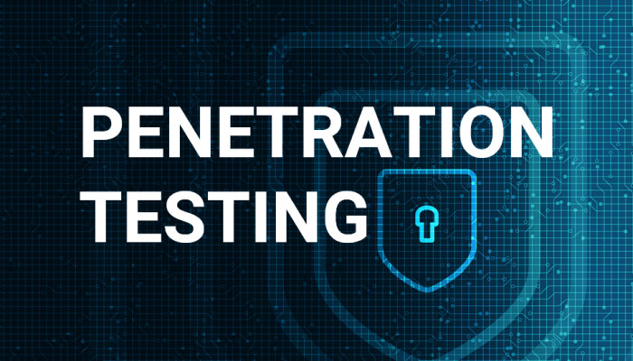

# CompTIA PenTest+ Labs 🛡️

Welcome to the CompTIA PenTest+ Labs repository! This repository contains a collection of labs created during my study journey for the CompTIA PenTest+ certification exam.

## About This Repository 📘

This repository serves as a collection of hands-on labs I completed while studying for the CompTIA PenTest+ certification. Each lab is designed to reinforce concepts covered in the PenTest+ exam objectives and provide practical experience in penetration testing and vulnerability management.

## About CompTIA PenTest+ 📚

CompTIA PenTest+ is a certification for cybersecurity professionals tasked with penetration testing and vulnerability management. It covers various aspects of penetration testing, including planning and scoping, information gathering and vulnerability identification, attacks and exploits, penetration testing tools, and reporting and communication.

## Labs Overview 📝

- [Lab 1: Planning and Scoping](#lab-1-planning-and-scoping)
- [Lab 2: Information Gathering](#lab-2-information-gathering)
- [Lab 3: Vulnerability Identification](#lab-3-vulnerability-identification)
- [Lab 4: Exploitation and Post-Exploitation](#lab-4-exploitation-and-post-exploitation)
- [Lab 5: Penetration Testing Tools](#lab-5-penetration-testing-tools)
- [Lab 6: Reporting and Communication](#lab-6-reporting-and-communication)

## Lab 1: Planning and Scoping 📊

Description: This lab focuses on the initial phase of penetration testing, including defining the scope of the assessment, identifying goals and objectives, and establishing rules of engagement.

## Lab 2: Information Gathering 🔍

Description: In this lab, you will learn techniques for gathering information about the target environment, including passive and active reconnaissance, open-source intelligence (OSINT) gathering, and footprinting.

## Lab 3: Vulnerability Identification 🛠️

Description: This lab covers the process of identifying vulnerabilities in the target environment, including vulnerability scanning, manual vulnerability assessment, and identifying misconfigurations.

## Lab 4: Exploitation and Post-Exploitation 💻

Description: In this lab, you will learn about various exploitation techniques, including network-based and web-based attacks, privilege escalation, and post-exploitation activities such as maintaining access and covering tracks.

## Lab 5: Penetration Testing Tools 🔧

Description: This lab introduces you to various penetration testing tools commonly used in the field, including network scanners, vulnerability scanners, exploitation frameworks, and post-exploitation tools.

## Lab 6: Reporting and Communication 📝

Description: The final lab focuses on the reporting and communication aspects of penetration testing, including documenting findings, preparing a penetration test report, and effectively communicating results to stakeholders.

## Usage 🚀

Each lab folder contains detailed instructions and resources for completing the lab exercises. Follow the instructions provided in each lab's README file to set up your environment and complete the exercises.

## Contributing 🤝

Contributions to this repository are welcome! If you have additional labs, exercises, or improvements to existing content, feel free to submit a pull request.

## License 📜

This repository is licensed under the MIT License. See the [LICENSE](LICENSE) file for details.
